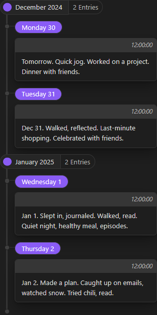
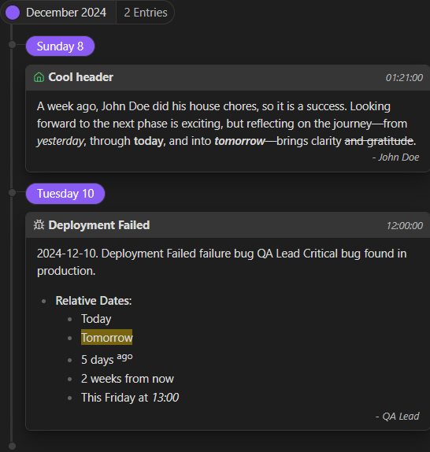

# Easy Timeline

The **Easy Timeline** plugin for Obsidian allows you to create timelines easily. It’s inspired by the [historica plugin](https://github.com/nhannht/obsidian-historica), and it’s designed for those who need a simple way to visualize events over time. It allows references in properties to be used by relative dates.

## How to Use Basic

You want to turn this into a timeline

```md
Tomorrow. Quick jog. Worked on a project. Dinner with friends.

Dec 31. Walked, reflected. Last-minute shopping. Celebrated with friends.

Jan 1. Slept in, journaled. Walked, read. Quiet night, healthy meal, episodes.

Jan 2. Made a plan. Caught up on emails, watched snow. Tried chili, read.
```

Creating a timeline is as easy as adding a simple block. Just use the following syntax:

````md
```timeline
```
````

That's all! The timeline block will automatically be processed, and each section will be defined by two new lines (or one in the settings).



### A Bit More

#### Block Content

You can either format it this way, where the timeline block renders content using the text outside the block:  

````md
Today. Slow breakfast. Organized, felt good. Watched a space doc, had veggies and quinoa.

Tomorrow. Quick jog. Worked on a project. Dinner with friends.

Dec 31. Walked, reflected. Last-minute shopping. Celebrated with friends.

Jan 1. Slept in, journaled. Walked, read. Quiet night, healthy meal, episodes.

Jan 2. Made a plan. Caught up on emails, watched snow. Tried chili, read.

```timeline
```
````

Or, you can format it this way, by placing the content inside the block. You can also use [explicit settings](#customizing-the-source-block) with this approach:

````md
```timeline sort:desc
Today. Slow breakfast. Organized, felt good. Watched a space doc, had veggies and quinoa.

Tomorrow. Quick jog. Worked on a project. Dinner with friends.

Dec 31. Walked, reflected. Last-minute shopping. Celebrated with friends.

Jan 1. Slept in, journaled. Walked, read. Quiet night, healthy meal, episodes.

Jan 2. Made a plan. Caught up on emails, watched snow. Tried chili, read.
```
````

#### Dates

Each section's date is determined by the first valid date mentioned in the section. You can use various formats supported by [Chronos](https://github.com/wanasit/chrono), including:

- **Relative Dates**:
  - Today
  - Tomorrow
  - 5 days ago
  - 2 weeks from now
  - This Friday at 13:00

- **Specific Dates**:
  - 17 August 2013
  - Sat Aug 17, 2013 18:40:39
  - 2014-11-30T08:15:30

Feel free to experiment with other date formats recognized by [Chronos](https://github.com/wanasit/chrono).

#### Reference

The relative dates (e.g. Today, Last week) will use the file created date as the reference by default but you can set it by having a 'created' property which the [Update Time](https://github.com/dsebastien/obsidian-update-time) is useful for. Use any valid [Chronos](https://github.com/wanasit/chrono) specific date format:

```yaml
created: 2018-12-14T18:56
```

or

```yaml
created: 14 December 2018, at 6:56pm
```

#### Customize sections

Customize sections using inline metadata for each sections such as author, icon, status, and title. The title metadata can be inferred from the heading. Icon use [fontawesome](https://fontawesome.com/v6/search?o=r&m=free). Status will change the color of the icon, the possible values are success, failure, warning, info. Like this:

```md
## Cool header
A week ago, [author:: John Doe] did his [icon:: house] chores, so it is a [status:: success]. Looking forward to the next phase is exciting, but reflecting on the journey—from *yesterday*, through **today**, and into ___tomorrow___—brings clarity ~~and gratitude~~.

2024-12-10. [title:: Deployment Failed] [status:: failure] [icon:: bug] [author:: QA Lead] Critical bug found in production.
- **Relative Dates**: 
  - Today
  - ==Tomorrow==
  - 5 days <sup>ago</sup>
  - 2 weeks from now
  - This Friday at _13:00_
```



If you don't want dataview to detect a inline metadata, just use a single colon (e.g. `[author: John Doe]` instead of `[author:: John Doe]`)

### Settings

- You can use a regex pattern to find which property to use by toggling the `Use Regex` setting. (e.g. set `(creat|ref)` in `Reference` setting)
- You can set which property name or regex to be used to get the reference by the `Reference` setting.
- You can set the default reference date to be the file's creation date or last modified date by the `Default Reference Date` setting.
- The default sorting is ascending. You can set the default sorting of a timeline to be ascending or descending by the `Default Sorting` setting.
- You can set if sections will be divided by a single line or double line by toggling the `Use single line` setting.

### Customizing the Source Block

You can provide explicit settings (`reference` and `sort`) in several ways. These settings have the highest precedence.

#### Explicit Reference

To explicitly set the reference for a timeline block, use any valid [Chronos](https://github.com/wanasit/chrono) specific date format.

**1. In the code block language line:**
````md
```timeline reference:"2011 Oct 25"
```
````

**2. Inside the block (on a separate line or inline):**

````md
```timeline
reference: 2011-10-25
[reference:: 2011-10-25]
```
````

**3. Outside the block (inline):**
````md
[reference:: 2011-10-25]
```timeline
```
````

#### Explicit Sorting

To explicitly set the sorting for a timeline block, you can use `asc` or `desc`.

**1. In the code block language line:**
````md
```timeline sort:asc
```
````

**2. Inside the block:**
````md
```timeline
sort: desc
[sort:: desc]
```
````

**3. Outside the block:**
````md
[sort:: desc]
```timeline
```
````

## Issues, Bugs, and Feature Requests

If you’ve found a bug, have an idea for a feature, or want to share feedback, please let me know by [opening an issue](https://github.com/Romelium/obsidian-easy-timeline/issues).

I’ll do my best to get back to you quickly.

## Funding

[](https://ko-fi.com/N4N317DZDN)
