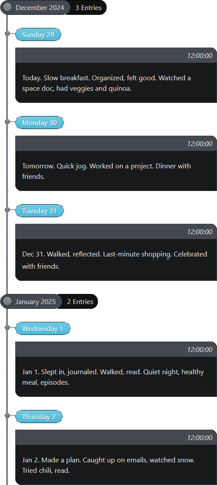
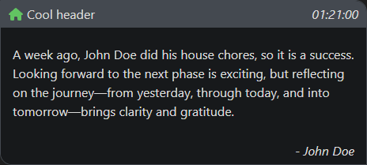

# Easy Timeline

The **Easy Timeline** plugin for Obsidian allows you to create timelines easily. It’s inspired by the [historica plugin](https://github.com/nhannht/obsidian-historica), and it’s designed for those who need a simple way to visualize events over time. It allows references in properties to be used by relative dates.

## How to Use Basic

You want to turn this into a timeline

```md
Today. Slow breakfast. Organized, felt good. Watched a space doc, had veggies and quinoa.

Tomorrow. Quick jog. Worked on a project. Dinner with friends.

Dec 31. Walked, reflected. Last-minute shopping. Celebrated with friends.

Jan 1. Slept in, journaled. Walked, read. Quiet night, healthy meal, episodes.

Jan 2. Made a plan. Caught up on emails, watched snow. Tried chili, read.
```

Creating a timeline is as easy as adding a simple block. Just use the following syntax:

````md
```timeline
```
````

That's all! The timeline block will automatically be processed, and each section will be defined by two new lines (or one in the settings).



### A Bit More

#### Dates

Each section's date is determined by the first valid date mentioned in the section. You can use various formats supported by [Chronos](https://github.com/wanasit/chrono), including:

- **Relative Dates**:
  - Today
  - Tomorrow
  - 5 days ago
  - 2 weeks from now
  - This Friday at 13:00

- **Specific Dates**:
  - 17 August 2013
  - Sat Aug 17, 2013 18:40:39
  - 2014-11-30T08:15:30

Feel free to experiment with other date formats recognized by [Chronos](https://github.com/wanasit/chrono).

#### Reference

The relative dates (e.g. Today, Last week) will use the file created date as the reference by default but you can set it by having a 'created' property which the [Update Time](https://github.com/dsebastien/obsidian-update-time) is useful for. Use any valid [Chronos](https://github.com/wanasit/chrono) specific date format:

```yaml
created: 2018-12-14T18:56
```

or

```yaml
created: 14 December 2018, at 6:56pm
```

#### Customize sections

Customize sections using inline metadata for each sections such as author, icon, status, and title. The title metadata can be inferred from the heading. Icon use [fontawesome](https://fontawesome.com/v6/search?o=r&m=free). Status will change the color of the icon, the possible values are success, failure, warning, info. Like this:

```md
## Cool header
A week ago, [author:: John Doe] did his [icon:: house] chores, so it is a [status:: success]. Looking forward to the next phase is exciting, but reflecting on the journey—from yesterday, through today, and into tomorrow—brings clarity and gratitude. 
```



If you don't want dataview to detect a inline metadata, just use a single colon (e.g. `[author: John Doe]` instead of `[author:: John Doe]`)

### Settings

- You can use a regex pattern to find which property to use by toggling the `Use Regex` setting. (e.g. set `(creat|ref)` in `Reference` setting)
- You can set which property name or regex to be used to get the reference by the `Reference` setting.
- The default sorting is ascending. You can set the default sorting of a timeline to be ascending or descending by the `Default Sorting` setting.
- You can set if sections will be divided by a single line or double line by toggling the `Use Regex` setting.

### Customizing the Source Block

#### Explicit Reference

To explicitly set the reference for a timeline block, you can include a `reference` field in the source. This will have the highest precedence. Use any valid [Chronos](https://github.com/wanasit/chrono) specific date format:

````md
```timeline
reference: 2011 Oct 25
```
````

or

````md
```timeline
reference: 2011-10-25
```
````

#### Explicit Sorting

To explicitly set the sorting for a timeline block. you can include a `sort` field in the source. This will have the highest precedence.

````md
```timeline
sort: asc
```
````

or

````md
```timeline
sort: dest
```
````

or

````md
```timeline
sort: Descending
```
````
